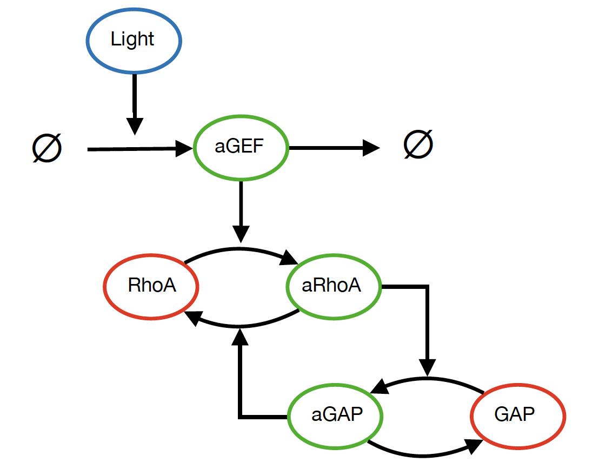
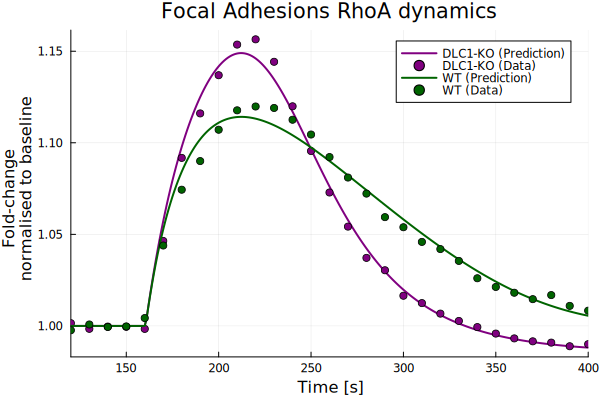
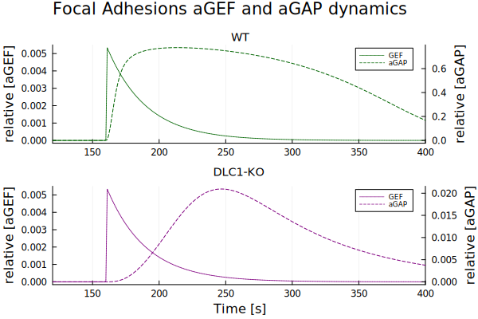

# RhoA Activity Modeling

This repository contains the Julia code for modeling the activity of the small GTPase RhoA in response to local light stimulation at the membrane and focal adhesions. 
The model is based on experimental data obtained from a study by [Heydasch et al. (2023)](https://doi.org/10.7554/eLife.90305.1), which investigates the role of DLC1, a GTPase activating protein, in the regulation of RhoA signaling.

### Purpose of the Model

The provided model aimed to describe the differential dynamics of RhoA activity as measured during the experiment. Specifically, the experimental setup involved local and transient light 
stimulation at the membrane and focal adhesions, with varying responses observed in the presence and absence of DLC1. The model was built using ModelingToolkit.jl and uses a system of 
ordinary differential equations (ODEs) to simulate RhoA activity over time under these different conditions at each localisation. RhoA activity dynamics were found to be best modelled 
by adding a negative feedback loop of RhoA on itself through GAPs activation as represented on the following figure:

The parameters of the model were fitted using various optimization packages of the SciML ecosystem such as [OrdinaryDiffEq.jl](https://docs.sciml.ai/OrdinaryDiffEq/stable/) 
and [Optimization.jl](https://docs.sciml.ai/Optimization/stable/).

Here are the key steps of code:
- Model Definition: The code defines the model using [ModelingToolkit.jl](https://docs.sciml.ai/ModelingToolkit/stable/), which allows for symbolic representation of the system of equations governing RhoA dynamics.
- Parameter Fitting: The model is fit to the experimental data to estimate the parameters governing RhoA activity in the presence and absence of DLC1.
  This is done using Optimization techniques in Julia.
- Results Plotting: Visualisation of the results for different experimental conditions (e.g., wild type vs DLC1 knockout).

### Repository Contents

This repository contains three main directories:

- Code:  
  Pluto/Jupyter notebooks that were used for modeling RhoA dynamics, fitting the model to experimental data, and visualizing the results. Also Julia scripts for parameter identifiability analysis. The Jupyter notebooks work with a Julia kernel and still require Julia to be installed alongside the package IJulia.jl. 
- Data:  
    Experimental data for RhoA activity under various conditions (presence or knock-out of DLC1). Source: Lucien Hinderling, Pertz Lab, Institute of Cell Biology, University of Bern.
- Plots:  
    Plots of the data fitting results at the membrane and focal adhesions.

### Installation

#### Install Julia
To run the code in this repository, you need to have Julia installed which can be downloaded at https://julialang.org/downloads/. Please note that Julia Version 1.10.4 was used as referenced
in the Manifest.toml file.

#### Clone the Repository

Clone this repository to your local machine.

git clone https://github.com/your-username/rhoa-activity-modeling.git

#### Install Dependencies
For reproducibility, it is recommended to use the directory of the project as a Julia environment: 
1. Go to the directory:  
   `cd /your_path_to_the_repo/rhoa-activity-modeling`
2. Open Julia and open the REPL by pressing ']'  
3. In the REPL, activate the local environment and instantiate the packages:  
   `pkg> activate .`  
   `pkg> instantiate`

### Usage
#### Running the Pluto Notebook

The Pluto notebook provides an interactive environment for running and visualizing the RhoA model. To open the notebook, follow these steps:
Start the Pluto notebook in Julia:  

    using Pluto
    Pluto.run()

In the Pluto interface, open the desired notebook file to start exploring the model, adjust parameters, and visualize the results.

#### Running the Julia Script

If you prefer running the model via a script instead of the Pluto notebook, you can directly execute the Julia script version. This script will 
define the model, perform parameter fitting, and output the results.

    julia --project="." <script_name>

The results will include a plot of the fitted dynamics for RhoA as well as the other model species.  
Here is an example of the output for the results at the focal adhesions:  

  

  

### Citation
If you use this code or model in your own research, please cite the following paper:

Max Heydasch, Lucien Hinderling, Jakobus van Unen, Maciej Dobrzynski, Olivier Pertz (2023). GTPase activating protein DLC1 spatio-temporally regulates Rho signaling. 
eLife 12:RP90305. DOI: https://doi.org/10.7554/eLife.90305.1 

### License

This repository is licensed under the MIT License. See the [LICENSE](./LICENSE.txt) for more details.
